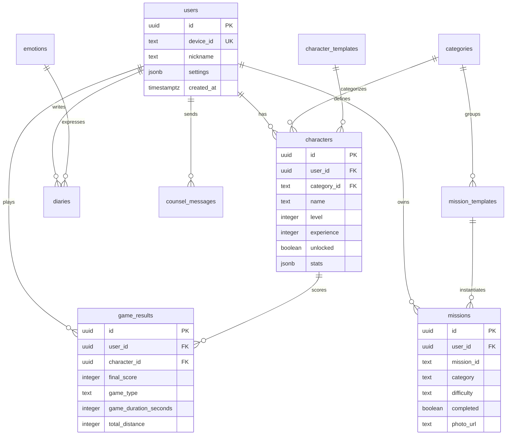

# Replant 데이터베이스 스키마 문서

Replant 프로젝트의 Supabase 데이터베이스 구조와 관계를 설명합니다.

## 📊 데이터베이스 개요

- **데이터베이스**: PostgreSQL (Supabase)
- **인증 방식**: 헤더 기반 닉네임 인증 (Base64 인코딩)
- **보안**: RLS 활성화 + 헤더 기반 정책
- **실시간 동기화**: Supabase Realtime 활용

## 🏗️ 테이블 구조

### users 테이블
사용자 기본 정보 및 설정 관리

```sql
users (
  id UUID PRIMARY KEY DEFAULT gen_random_uuid(),
  device_id TEXT UNIQUE,
  nickname TEXT,
  nickname_created_at TIMESTAMPTZ DEFAULT now(),
  settings JSONB DEFAULT '{}',
  created_at TIMESTAMPTZ DEFAULT now(),
  updated_at TIMESTAMPTZ DEFAULT now(),
  last_active_at TIMESTAMPTZ DEFAULT now()
)
```

**주요 필드**:
- `device_id`: 기기 고유 식별자 (로컬 저장소 기반)
- `nickname`: 사용자 닉네임 (2-20자, 한글/영문/숫자)
- `settings`: JSON 형태의 사용자 설정 (대표 캐릭터 등)

### characters 테이블
캐릭터 진행 상태 및 통계 관리

```sql
characters (
  id UUID PRIMARY KEY DEFAULT gen_random_uuid(),
  user_id UUID REFERENCES users(id),
  category_id TEXT,
  name TEXT NOT NULL,
  level INTEGER DEFAULT 1,
  experience INTEGER DEFAULT 0,
  max_experience INTEGER DEFAULT 500,
  total_experience INTEGER DEFAULT 0,
  unlocked BOOLEAN DEFAULT false,
  unlocked_date TIMESTAMPTZ,
  achievements JSONB DEFAULT '[]',
  stats JSONB DEFAULT '{"streak": 0, "daysActive": 0, "longestStreak": 0, "missionsCompleted": 0}',
  created_at TIMESTAMPTZ DEFAULT now(),
  updated_at TIMESTAMPTZ DEFAULT now()
)
```


### missions 테이블
사용자별 미션 완료 상태 관리

```sql
missions (
  id UUID PRIMARY KEY DEFAULT gen_random_uuid(),
  user_id UUID REFERENCES users(id),
  mission_id TEXT NOT NULL,
  title TEXT NOT NULL,
  description TEXT,
  emoji TEXT,
  category TEXT NOT NULL,
  difficulty TEXT CHECK (difficulty IN ('easy', 'medium', 'hard')),
  experience INTEGER DEFAULT 0,
  completed BOOLEAN DEFAULT false,
  completed_at TIMESTAMPTZ,
  photo_url TEXT,
  photo_submitted_at TIMESTAMPTZ,
  video_url TEXT,
  video_submitted_at TIMESTAMPTZ,
  created_at TIMESTAMPTZ DEFAULT now(),
  updated_at TIMESTAMPTZ DEFAULT now()
)
```


### diaries 테이블
감정 일기 데이터 관리

```sql
diaries (
  id UUID PRIMARY KEY DEFAULT gen_random_uuid(),
  user_id UUID REFERENCES users(id),
  date DATE NOT NULL,
  emotion_id TEXT,
  content TEXT,
  created_at TIMESTAMPTZ DEFAULT now(),
  updated_at TIMESTAMPTZ DEFAULT now()
)
```

### categories 테이블
미션 카테고리 정보

```sql
categories (
  id TEXT PRIMARY KEY,
  name TEXT NOT NULL,
  emoji TEXT NOT NULL,
  color TEXT NOT NULL,
  description TEXT,
  created_at TIMESTAMPTZ DEFAULT now()
)
```

**기본 카테고리**:
- `exercise` (운동): 🏃‍♂️ 
- `cleaning` (청소): 🧹
- `reading` (독서): 📚
- `selfcare` (자기돌봄): 🌸
- `social` (사회활동): 👥
- `creativity` (창의활동): 🎨

### emotions 테이블
감정 데이터 정의

```sql
emotions (
  id TEXT PRIMARY KEY,
  emoji TEXT NOT NULL,
  label TEXT NOT NULL,
  color TEXT NOT NULL,
  description TEXT,
  created_at TIMESTAMPTZ DEFAULT now(),
  updated_at TIMESTAMPTZ DEFAULT now()
)
```

**기본 감정**:
- `happy` (행복한): 😊
- `excited` (신나는): 🤩  
- `calm` (평온한): 😌
- `grateful` (감사한): 🙏
- `sad` (슬픈): 😢
- `angry` (화난): 😠
- `anxious` (불안한): 😰
- `tired` (피곤한): 😴

### mission_templates 테이블
미션 템플릿 데이터

```sql
mission_templates (
  id INTEGER PRIMARY KEY,
  mission_id TEXT UNIQUE NOT NULL,
  title TEXT NOT NULL,
  description TEXT,
  emoji TEXT,
  category_id TEXT,
  difficulty TEXT,
  experience INTEGER DEFAULT 50,
  created_at TIMESTAMPTZ DEFAULT now()
)
```

### character_templates 테이블
캐릭터 템플릿 정보

```sql
character_templates (
  id INTEGER PRIMARY KEY,
  level INTEGER UNIQUE NOT NULL,
  name TEXT NOT NULL,
  title TEXT NOT NULL,
  default_image TEXT NOT NULL,
  waving_image TEXT NOT NULL,
  happy_image TEXT NOT NULL,
  description TEXT,
  experience_required INTEGER NOT NULL,
  created_at TIMESTAMPTZ DEFAULT now(),
  updated_at TIMESTAMPTZ DEFAULT now()
)
```

### counsel_messages 테이블
상담 채팅 메시지 관리

```sql
counsel_messages (
  id UUID PRIMARY KEY DEFAULT gen_random_uuid(),
  user_id UUID REFERENCES users(id),
  session_id TEXT NOT NULL,
  message TEXT NOT NULL,
  is_user BOOLEAN DEFAULT true,
  timestamp TIMESTAMPTZ DEFAULT now(),
  created_at TIMESTAMPTZ DEFAULT now()
)
```

### game_results 테이블
게임 결과 및 점수 관리

```sql
game_results (
  id UUID PRIMARY KEY DEFAULT gen_random_uuid(),
  user_id UUID REFERENCES users(id),
  character_id UUID REFERENCES characters(id),
  final_score INTEGER NOT NULL,
  base_score INTEGER DEFAULT 0,
  bonus_score INTEGER DEFAULT 0,
  obstacles_avoided INTEGER DEFAULT 0,
  game_duration_seconds INTEGER DEFAULT 0,
  total_distance INTEGER DEFAULT 0,
  difficulty_level INTEGER DEFAULT 1,
  character_level INTEGER,
  character_name TEXT,
  character_category_id TEXT,
  game_type TEXT DEFAULT 'obstacle' NOT NULL,
  game_version TEXT DEFAULT '1.0',
  created_at TIMESTAMPTZ DEFAULT now()
)
```


## 🔗 테이블 관계



## 🔐 보안 정책 (RLS)

### 현재 상태 (보안 강화 모드)
- `users`: RLS 활성화 ✅ (헤더 기반 정책)
- `characters`: RLS 활성화 ✅ (헤더 기반 정책)
- `missions`: RLS 활성화 ✅ (헤더 기반 정책)
- `diaries`: RLS 활성화 ✅ (헤더 기반 정책)
- `counsel_messages`: RLS 활성화 ✅ (헤더 기반 정책)
- `game_results`: RLS 활성화 ✅ (헤더 기반 정책)
- `emotions`: RLS 활성화 ✅ (공용 데이터)
- `categories`: RLS 활성화 ✅ (공용 데이터)
- `mission_templates`: RLS 활성화 ✅ (공용 데이터)
- `character_templates`: RLS 활성화 ✅ (공용 데이터)


### 보안 특징
- **헤더 기반 인증**: `x-nickname-b64` 헤더로 사용자 식별
- **Base64 인코딩**: 한글 닉네임 안전 전송
- **자동 헤더 주입**: 클라이언트에서 모든 요청에 자동 주입
- **데이터 분리**: 사용자별 데이터 완전 분리
- **공용 데이터**: emotions, categories 등은 모든 사용자 접근 가능


## ⚡ 데이터베이스 함수

프로젝트에서 사용하는 주요 PostgreSQL 함수들:

### 사용자 관리
- `create_user_with_nickname(nickname, device_id)`: 닉네임으로 사용자 생성
- `get_user_by_nickname(nickname)`: 닉네임으로 사용자 조회
- `check_nickname_duplicate(nickname)`: 닉네임 중복 확인
- `validate_nickname(nickname)`: 닉네임 유효성 검사
- `set_nickname_session(nickname)`: 세션에 닉네임 설정
- `update_user_nickname_safe(current_nickname, new_nickname)`: 안전한 닉네임 변경

### 캐릭터 관리
- `auto_levelup_character(character_id, experience_gained)`: 자동 레벨업 처리
- `reset_character_name_to_default(character_id)`: 캐릭터 이름 기본값 복원
- `initialize_user_data(user_id)`: 사용자 데이터 초기화

### 카테고리 관리  
- `sync_categories_from_missions()`: 미션에서 카테고리 동기화
- `trigger_sync_categories()`: 카테고리 동기화 트리거


## 📈 성능 최적화

### 인덱스 권장사항
```sql
-- 자주 쿼리되는 컬럼에 인덱스 추가
CREATE INDEX idx_missions_user_category ON missions(user_id, category);
CREATE INDEX idx_characters_user_category ON characters(user_id, category_id);
CREATE INDEX idx_diaries_user_date ON diaries(user_id, date);
```

### 쿼리 최적화
- 사용자별 데이터 필터링 우선 적용
- 카테고리별 캐릭터 조회 최적화
- 완료된 미션 페이지네이션 구현 고려

## 🔧 마이그레이션 관리

### 스키마 변경 절차
1. 로컬에서 변경 사항 테스트
2. 마이그레이션 파일 생성
3. 스테이징 환경에서 검증
4. 프로덕션 배포

### 백업 함수
`supabase_functions_backup/` 폴더의 SQL 파일들은 주요 데이터베이스 함수의 백업입니다:

- `auto_levelup_character.sql`: 캐릭터 자동 레벨업
- `create_user_with_nickname.sql`: 닉네임 기반 사용자 생성
- `initialize_user_data.sql`: 사용자 데이터 초기화
- `validate_nickname.sql`: 닉네임 유효성 검사
- `update_user_nickname_safe.sql`: 안전한 닉네임 변경
- `set_nickname_session.sql`: 세션 닉네임 설정
- 기타 관리 함수들

## 🔍 쿼리 예시

### 사용자 진행 상황 조회
```sql
SELECT 
  u.nickname,
  COUNT(CASE WHEN m.completed = true THEN 1 END) as completed_missions,
  SUM(CASE WHEN m.completed = true THEN m.experience ELSE 0 END) as total_experience,
  COUNT(CASE WHEN c.unlocked = true THEN 1 END) as unlocked_characters
FROM users u
LEFT JOIN missions m ON u.id = m.user_id
LEFT JOIN characters c ON u.id = c.user_id
WHERE u.nickname = 'example_user'
GROUP BY u.id, u.nickname;
```

### 카테고리별 진행률 조회
```sql
SELECT 
  m.category,
  COUNT(*) as total_missions,
  COUNT(CASE WHEN m.completed = true THEN 1 END) as completed_missions,
  ROUND(COUNT(CASE WHEN m.completed = true THEN 1 END) * 100.0 / COUNT(*), 1) as completion_rate
FROM missions m
WHERE m.user_id = $1
GROUP BY m.category
ORDER BY completion_rate DESC;
```

## ⚠️ 주의사항

### 데이터 일관성
- 미션 완료 시 캐릭터 경험치 자동 업데이트
- 레벨업 시 캐릭터 이미지 자동 변경
- 카테고리별 첫 미션 완료 시 캐릭터 자동 해제

### 보안 고려사항
- **현재**: RLS 활성화 + 헤더 기반 인증으로 보안 강화
- **헤더 주입**: 모든 요청에 `x-nickname-b64` 헤더 자동 주입
- **한글 지원**: Base64 인코딩으로 한글 닉네임 안전 처리
- **데이터 분리**: 사용자별 데이터 완전 분리 보장
- **공용 데이터**: emotions, categories 등은 모든 사용자 접근 가능

### 성능 고려사항
- 일기 데이터는 날짜별 인덱싱 권장
- 헤더 기반 RLS 정책으로 성능 최적화

## 🔄 데이터 마이그레이션

### 초기 데이터 설정
```sql
-- 감정 데이터 초기화
INSERT INTO emotions (id, emoji, label, color) VALUES
('happy', '😊', '행복한', '#10B981'),
('excited', '🤩', '신나는', '#F59E0B'),
-- ... 기타 감정들

-- 카테고리 초기화  
INSERT INTO categories (id, name, emoji, color) VALUES
('exercise', '운동', '🏃‍♂️', '#EF4444'),
('cleaning', '청소', '🧹', '#3B82F6'),
-- ... 기타 카테고리들
```

### 데이터 정리
```sql
-- 사용자 데이터 완전 삭제 (개발용)
DELETE FROM counsel_messages WHERE user_id = $1;
DELETE FROM diaries WHERE user_id = $1;
DELETE FROM missions WHERE user_id = $1;
DELETE FROM characters WHERE user_id = $1;
DELETE FROM users WHERE id = $1;
```

## 📚 관련 문서

- [설정 가이드](README.md)
- [API 참조](API.md)
- [컴포넌트 가이드](src/components/README.md)
- [Supabase 공식 문서](https://supabase.com/docs)