# Replant 프로젝트 소개

**데모 링크**: [https://kimmireu0220.github.io/Replant](https://kimmireu0220.github.io/Replant/)

> 💡 **테스트 환경**: 아래 스크린샷은 '테스트유저'로 미리 설정된 상태에서 촬영되었습니다. 
- (로그인 화면에서 '테스트유저' 라는 닉네임으로 접속할 경우 아래 스크린샷과 동일한 화면을 볼 수 있습니다.)

## 📋 목차
- [핵심 기능](#핵심-기능)
- [사용자 플로우](#-사용자-플로우)
- [주요 페이지](#-주요-페이지)
  - [홈](#-홈)
  - [감정 일기](#-감정-일기)
  - [미션](#-미션-6개-카테고리-30개-미션)
  - [미니게임](#-미니게임)
  - [캐릭터 도감](#-캐릭터-도감)
  - [상담](#-상담)

## 핵심 기능
- **홈**: 대표 캐릭터 표시 및 추천 미션 제공
- **감정 일기**: 8가지 감정 중 하나 선택 & 일기 기록
- **미션 시스템**: 6개 카테고리별 미션 완료로 해당 카테고리 캐릭터 경험치 획득 → 레벨업 (첫 미션 완료 시 캐릭터 잠금 해제)
- **미니게임**: 4종류 게임으로 스트레스 해소 (장애물 달리기, 퍼즐, 기억력, 퀴즈)
- **캐릭터 도감**: 6개 카테고리별 수집형 캐릭터 시스템으로 지속적 참여 유도
- **상담 서비스**: 전문 상담사와 AI 챗봇 중 선택하여 채팅 형태 상담

---

## 🔄 사용자 플로우

### 신규 사용자
1. **온보딩** → 앱 개요 + 5개 핵심 메뉴 소개
   
2. **닉네임 입력/생성** → 기존 닉네임 확인 또는 새 닉네임 생성
   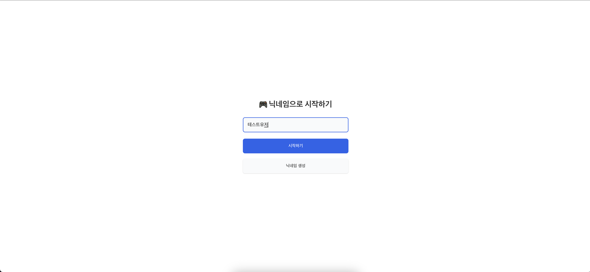
3. **홈 확인** → 아직 모든 캐릭터가 잠금 상태, 기본 상태
4. **첫 미션 완료** → 해당 카테고리 캐릭터 잠금 해제 (예: 청소 미션 → 청소 캐릭터 해제)
5. **캐릭터 도감** → 잠금 해제된 캐릭터 중에서 사용자 대표 캐릭터 설정 가능 (홈 화면 표시, 미니게임에서 사용)
6. **감정 일기 & 미니게임 & 상담** → 원하는 기능 자유롭게 활용

### 일반적인 사용
- 특정 카테고리 미션 완료 → 해당 카테고리 캐릭터 잠금 해제 → 경험치 획득 → 레벨업(캐릭터 레벨과 이미지 바뀜)
- 감정 기록 (독립적 활동)
- 미니게임으로 스트레스 해소 (독립적 활동)

---

## 📋 주요 페이지

### 🏠 홈
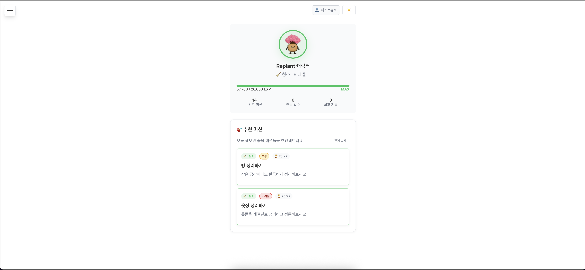
- 대표 캐릭터 & 레벨 표시 (신규 사용자는 모든 캐릭터가 잠금 상태 -> 미션 수행 후 캐릭터 해제 가능)
- 추천 미션 카드
- 경험치 진행도 바

### 📝 감정 일기

#### 일기 목록
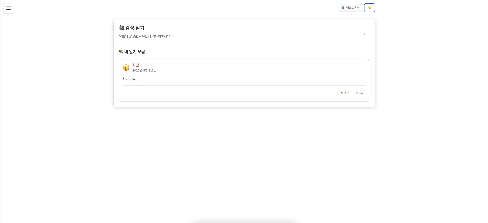
- 작성된 감정 일기 목록 확인
- 감정 이모티콘과 날짜 표시
- 수정/삭제 기능 제공

#### 일기 작성

- 8가지 감정 아이콘 선택
- 자유 텍스트 일기 작성 (최대 1000자)
- 날짜 선택 및 저장 기능

### 📋 미션 (6개 카테고리, 60개 미션)

#### 전체 미션 탭
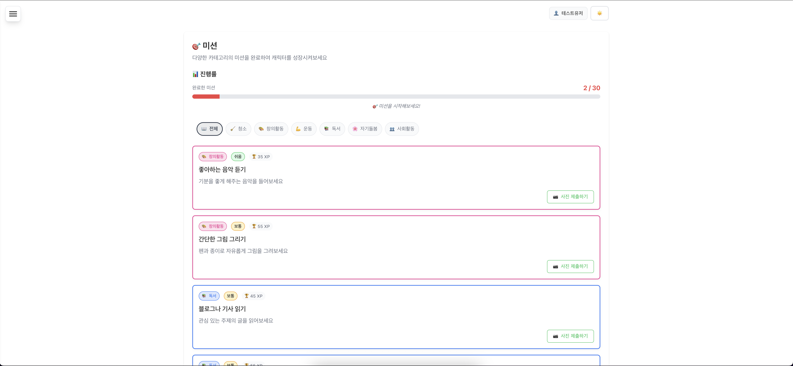
- 모든 카테고리의 미션을 한 번에 확인
- 6개 카테고리 탭으로 필터링 가능

#### 청소 카테고리 탭
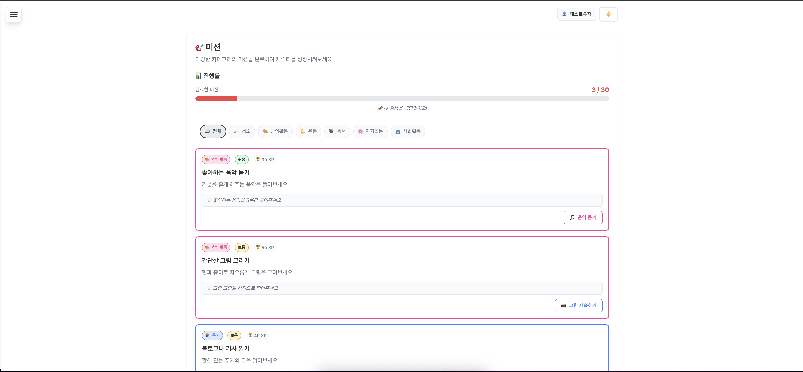
- 카테고리별 미션 필터링 기능
- 청소 관련 미션들만 표시

#### 완료/미완료 미션 비교
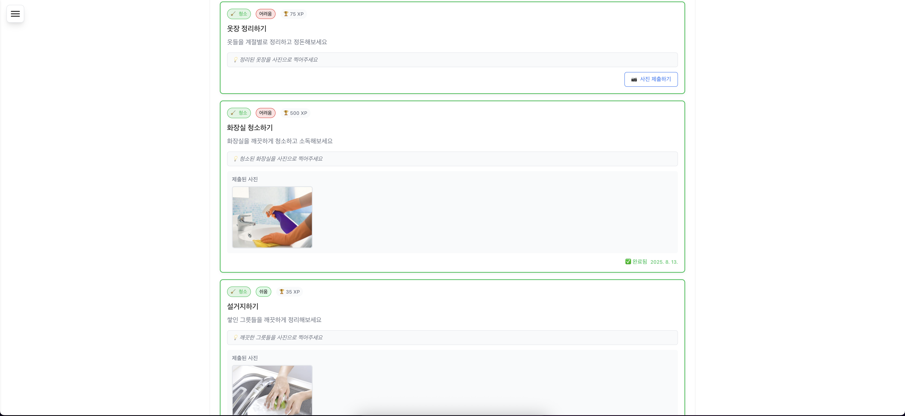
- 완료된 미션은 체크 표시와 완료 날짜 표시
- 미완료 미션은 "사진 제출하기" 버튼 제공
- 미션 완료 시 즉시 경험치 반영

### 🎮 미니게임

#### 게임 선택
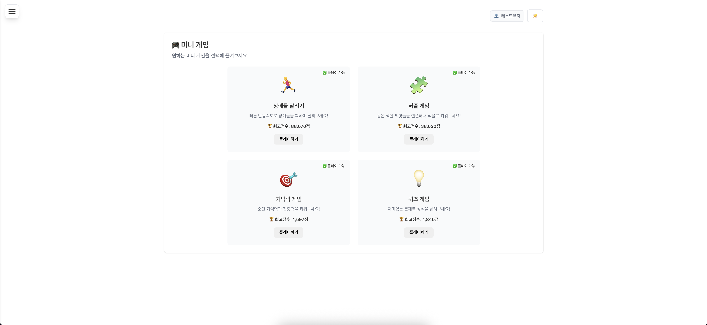
- 4종류 게임 (장애물 달리기, 퍼즐, 기억력, 퀴즈)
- 각 게임별 최고 점수 표시
- "플레이하기" 버튼으로 게임 시작

#### 게임 플레이
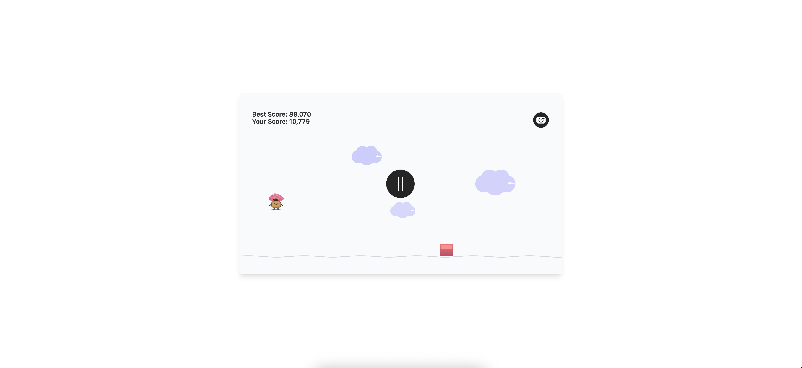
- 장애물 달리기 게임 플레이 화면
- 최고 점수와 현재 점수 표시
- 일시정지 및 게임 화면 스크린샷 기능

### 📖 캐릭터 도감

#### 캐릭터 목록
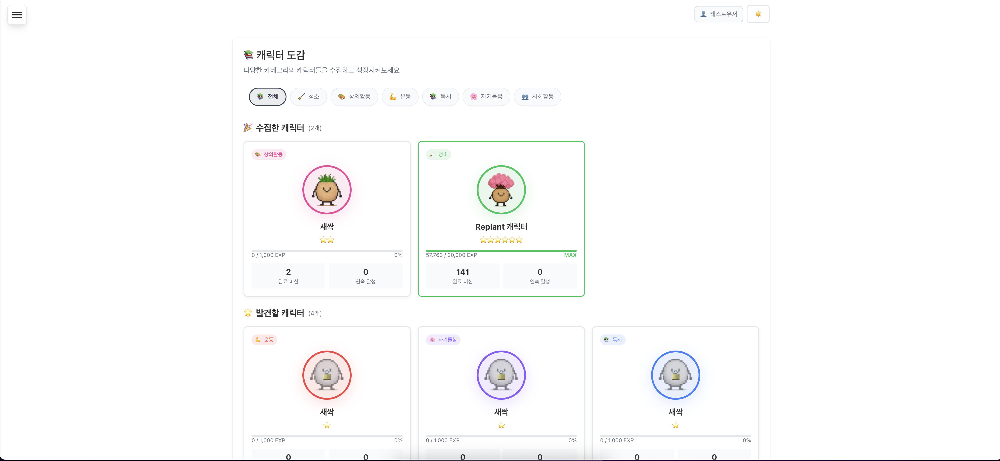
- 카드 그리드 형태 캐릭터 목록 (6개 카테고리별)
- 잠금/잠금 해제 상태 표시 (처음엔 모든 카테고리 캐릭터가 잠금)
- 카테고리별 필터링 기능
- 수집한 캐릭터(미션 수행 완료한 카테고리)와 발견할 캐릭터(아직 미션 수행 완료하지 않은 카테고리) 구분

#### 캐릭터 상세정보

##### 대표 캐릭터 설정 전
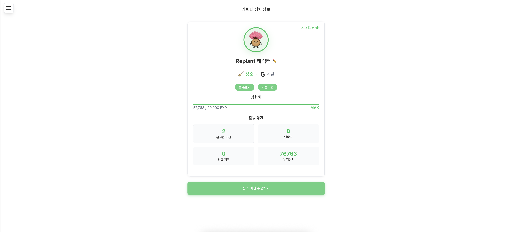
- 캐릭터 클릭 시 상세정보 화면
- 레벨, 경험치, 활동 통계 표시
- "대표캐릭터 설정" 버튼으로 홈 화면 대표 캐릭터 지정
- 캐릭터 감정 표현 (손 흔들기, 기쁨 표현) 기능
- 해당 카테고리 미션 수행 버튼

##### 대표 캐릭터 설정 후

- "✓ 대표 캐릭터가 설정되었습니다!" 알림 표시
- 캐릭터 우상단에 "대표 캐릭터" 태그 표시
- 설정 완료 후 홈 화면에서 해당 캐릭터가 대표로 표시됨

### 💬 상담

#### 상담 선택
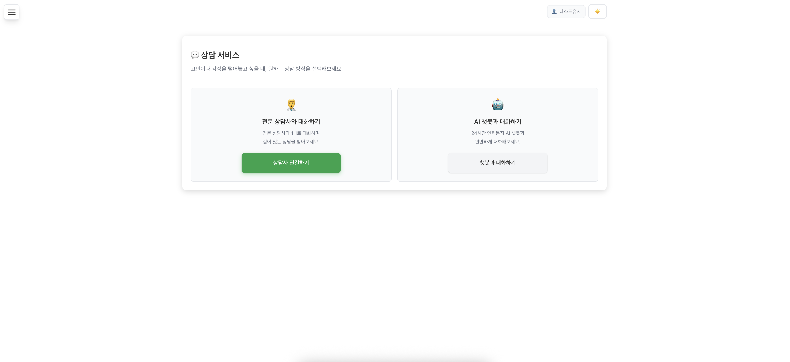
- **전문 상담사**: 실제 전문가와의 1:1 상담 (응답 시간: 24시간 이내)
- **AI 챗봇**: 즉시 응답 가능한 AI 기반 상담 (24시간 운영)
- 각 상담 방식별 특징과 적합한 상황 안내

#### 상담 채팅
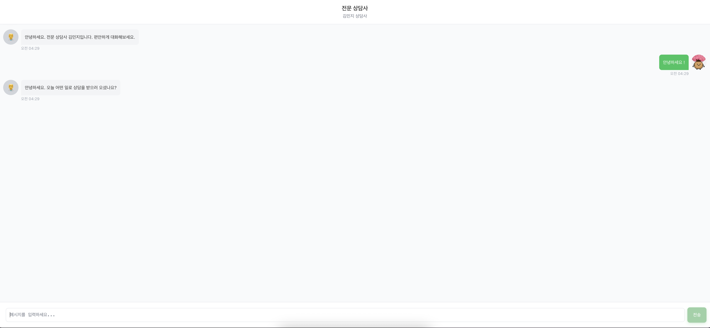
- 전문 상담사와 채팅 형태 대화
- 실시간 메시지 전송 및 응답
- 세션별 대화 기록 저장

